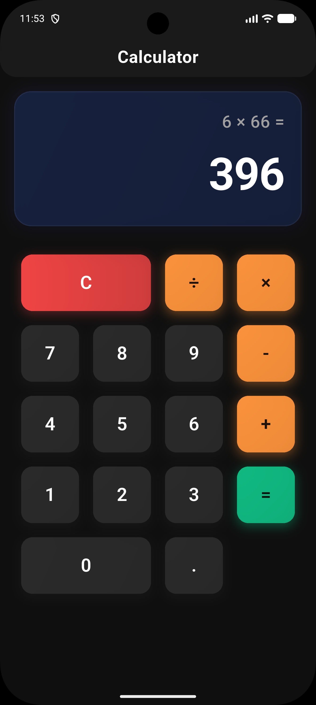
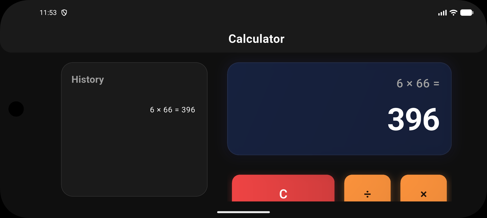
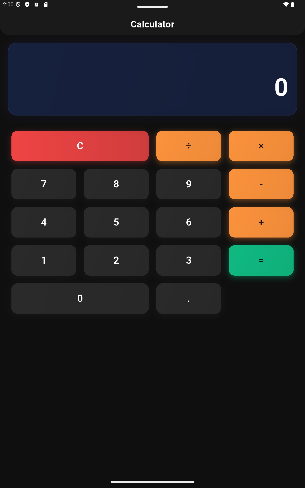
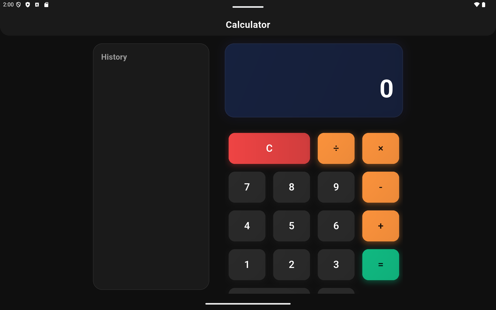

# Simple Calculator

A premium, highly responsive calculator built with Flutter, featuring a modern glassmorphic design, haptic feedback, and a seamless native feel for both mobile and tablet devices.

## ✨ Features

- **Modern Glassmorphism**: A sleek UI with subtle gradients, soft shadows, and refined borders for a premium aesthetic.
- **Dual-Display System**: Simultaneously view your full expression (e.g., `5 + 3 =`) and the live result/preview.
- **Adaptive UI/UX**:
  - **Portrait (Mobile)**: A classic, focused calculator experience.
  - **Landscape (Mobile)**: Intelligent side-by-side layout (Display on left, Buttons on right) to maximize vertical space.
  - **Tablet Layout**: Automatically detects large screens and adds a dedicated **History Panel**.
- **Tactile Feedback**: Integrated haptic feedback (light/medium impacts) provides a physical, native feel during interaction.
- **Overflow Resilience**: Built to handle various screen sizes and system scaling without layout crashes.
- **Modern Theme**: Clean dark theme utilizing Material 3 principles.

## 📸 App Snapshots

| Mobile Portrait | Mobile Landscape |
| :---: | :---: |
|  |  |

| Tablet Portrait | Tablet Landscape (with History) |
| :---: | :---: |
|  |  |

## 🏗️ Project Structure

The project follows a clean, modular architecture to make it easy to learn and extend:

```text
lib/
├── constants/         # Theme colors, dimensions, and static strings.
├── models/            # Business logic and state management (CalculatorState).
├── screens/           # Main UI screens (CalculatorScreen).
├── widgets/           # Reusable UI components (Buttons, Displays).
└── main.dart          # Application entry point and system configuration.
snapshots/             # Screenshots and design references.
```

## 🚀 Getting Started

1.  **Clone the project**:
    ```bash
    git clone https://github.com/your-username/simple_calculator.git
    ```
2.  **Install dependencies**:
    ```bash
    flutter pub get
    ```
3.  **Run the app**:
    ```bash
    flutter run
    ```

## 📚 Key Concepts Used

- **State Management**: Using `StatefulWidget` and a dedicated `CalculatorState` class to separate logic from UI.
- **Responsive Layouts**: Leveraging `LayoutBuilder` and `MediaQuery` for adaptive design.
- **TextEditingControllers**: Used to drive the display fields, providing a native text feel without allowing manual user input.
- **Haptic Feedback**: Using `flutter/services.dart` to trigger device vibrations for button presses.
- **Animations**: `Transform.scale` is used for smooth button-press effects.

## 📱 Platforms Supported

- ✅ Android (Optimized for Mobile & Tablet)
- ✅ iOS (Optimized for Mobile & Tablet)
- ✅ Web & Desktop (Adaptive layout support)

---
*Created with ❤️ using Flutter.*
